# Snowflake Data Engineering - Basic Snowpipe

&nbsp;&nbsp;&nbsp;&nbsp;&nbsp;&nbsp;&nbsp;&nbsp;

A Snowflake data engineering project demonstrating automated data ingestion using Snowpipe, Infrastructure as Code (Terraform), and role-based access control governance.

## Overview

This repository implements a complete Snowflake data pipeline with:

- **Infrastructure as Code**: Terraform configurations for Snowflake resources
- **Automated Ingestion**: Snowpipe for continuous data loading
- **Role-Based Governance**: Separate provisioner roles for different object types
- **JSON-Driven Configuration**: External configuration files for easy customization
- **Modular Architecture**: Reusable Terraform modules for each resource type

## Repository Structure

```
.
├── infra/                              # Infrastructure as Code
│   └── snowflake/tf/                   # Snowflake Terraform configuration
│       ├── main.tf                     # Resource orchestration (modules)
│       ├── locals.tf                   # Configuration parsing from JSON
│       ├── variables.tf                # Input variables
│       ├── outputs.tf                  # Module outputs
│       ├── versions.tf                 # Terraform & provider versions
│       ├── backend.tf                  # Terraform backend configuration
│       ├── providers-snowflake.tf      # Snowflake provider with role aliases
│       ├── terraform.tfvars            # Variable values
│       └── templates/                  # Template files
│           └── snowpipe-copy-statement.tpl
├── input-jsons/                        # Configuration files
│   └── snowflake/
│       └── config.json                 # Snowflake resource configuration
├── sample-data/                        # Sample CSV data files
│   ├── sales01.csv
│   └── sales02.csv
├── .github/
│   └── workflows/                      # GitHub Actions CI/CD
│       ├── ci.yaml                     # Continuous integration
│       ├── terraform-deploy.yaml       # Terraform deployment
│       └── terraform-destroy.yaml      # Terraform destroy
├── .devcontainer/                      # Dev container configuration
├── utils/                              # Utility scripts
└── README.md
```

## Architecture

```mermaid
flowchart LR
    subgraph WAREHOUSES["1. WAREHOUSES"]
        WH[Compute resources for query execution]
    end

    subgraph DATABASES["2. DATABASES & SCHEMAS"]
        DB[Logical containers for data organization]
    end

    subgraph FILEFORMATS["3. FILE FORMATS"]
        FF[Define parsing rules for data files<br/>CSV, JSON, etc.]
    end

    subgraph STAGES["4. INTERNAL STAGES"]
        STG[Named storage locations for file staging]
    end

    subgraph TABLES["5. TABLES"]
        TBL[Target tables for data ingestion]
    end

    subgraph SNOWPIPES["6. SNOWPIPES"]
        PIPE[Auto-ingest pipelines for<br/>continuous data loading]
    end

    WAREHOUSES --> DATABASES
    DATABASES --> FILEFORMATS
    FILEFORMATS --> STAGES
    STAGES --> TABLES
    TABLES --> SNOWPIPES

    style WAREHOUSES fill:#e1f5fe,stroke:#01579b
    style DATABASES fill:#e8f5e9,stroke:#1b5e20
    style FILEFORMATS fill:#fff3e0,stroke:#e65100
    style STAGES fill:#f3e5f5,stroke:#4a148c
    style TABLES fill:#fce4ec,stroke:#880e4f
    style SNOWPIPES fill:#e0f2f1,stroke:#004d40
```



## Security & Governance

### Role-Based Access Control (RBAC)

This project implements a **least-privilege governance model** using dedicated admin roles for different Snowflake object types. Each role has specific permissions to create and manage only the objects within its domain, following Snowflake's recommended security best practices.

#### Admin Roles Overview

| Role | Purpose | Objects Managed | Provider Alias |
|------|---------|-----------------|----------------|
| `WAREHOUSE_ADMIN` | Warehouse lifecycle management | Warehouses | `snowflake.warehouse_provisioner` |
| `PLATFORM_DB_ADMIN` | Database & schema administration | Databases, Schemas | `snowflake.db_provisioner` |
| `DATA_OBJECT_ADMIN` | Data object administration | File Formats, Tables | `snowflake.data_object_provisioner` |
| `INGEST_ADMIN` | Ingestion pipeline administration | Stages, Snowpipes | `snowflake.ingest_object_provisioner` |

#### Role Hierarchy & Responsibilities

```
                                    ACCOUNTADMIN
                                         │
                          ┌──────────────┼──────────────┐
                          │              │              │
                          ▼              ▼              ▼
                     SYSADMIN      SECURITYADMIN    USERADMIN
                          │
      ┌───────────────────┼───────────────────┬───────────────────┐
      │                   │                   │                   │
      ▼                   ▼                   ▼                   ▼
WAREHOUSE_ADMIN    PLATFORM_DB_ADMIN   DATA_OBJECT_ADMIN    INGEST_ADMIN
      │                   │                   │                   │
      ▼                   ▼                   ▼                   ▼
 Warehouses          Databases          File Formats          Stages
                     Schemas            Tables                Snowpipes
```

#### Role Details

##### WAREHOUSE_ADMIN
- **Purpose**: Manages compute resources for query execution
- **Privileges**:
  - `CREATE WAREHOUSE` on account
  - `MODIFY`, `MONITOR`, `OPERATE` on warehouses
- **Use Case**: Controls warehouse sizing, auto-suspend, scaling policies

##### PLATFORM_DB_ADMIN
- **Purpose**: Manages logical data containers
- **Privileges**:
  - `CREATE DATABASE` on account
  - `CREATE SCHEMA` on databases
  - `USAGE` on databases and schemas
- **Use Case**: Creates and organizes databases/schemas for different data domains

##### DATA_OBJECT_ADMIN
- **Purpose**: Manages data storage objects
- **Privileges**:
  - `CREATE FILE FORMAT` on schemas
  - `CREATE TABLE` on schemas
  - `USAGE` on databases and schemas
- **Use Case**: Defines data structures, file parsing rules, table schemas

##### INGEST_ADMIN
- **Purpose**: Manages data ingestion pipelines
- **Privileges**:
  - `CREATE STAGE` on schemas
  - `CREATE PIPE` on schemas
  - `READ`, `WRITE` on stages
  - `INSERT`, `SELECT` on tables (granted by DATA_OBJECT_ADMIN)
- **Use Case**: Sets up automated data loading from stages to tables

#### How Role Separation Works

1. **Terraform Provider Aliases**: Each admin role has a dedicated Snowflake provider alias configured in `providers-snowflake.tf`:

```hcl
# Warehouse operations
provider "snowflake" {
  alias = "warehouse_provisioner"
  role  = var.warehouse_provisioner_role  # WAREHOUSE_ADMIN
}

# Database/Schema operations
provider "snowflake" {
  alias = "db_provisioner"
  role  = var.db_provisioner_role  # PLATFORM_DB_ADMIN
}

# File Format/Table operations
provider "snowflake" {
  alias = "data_object_provisioner"
  role  = var.data_object_provisioner_role  # DATA_OBJECT_ADMIN
}

# Stage/Pipe operations
provider "snowflake" {
  alias = "ingest_object_provisioner"
  role  = var.ingest_object_provisioner_role  # INGEST_ADMIN
}
```

2. **Module Provider Assignment**: Each Terraform module uses the appropriate provider based on the objects it manages:

```hcl
# Warehouses managed by WAREHOUSE_ADMIN
module "warehouse" {
  providers = { snowflake = snowflake.warehouse_provisioner }
}

# Databases/Schemas managed by PLATFORM_DB_ADMIN
module "database_schemas" {
  providers = { snowflake = snowflake.db_provisioner }
}

# File Formats/Tables managed by DATA_OBJECT_ADMIN
module "file_formats" {
  providers = { snowflake = snowflake.data_object_provisioner }
}
module "table" {
  providers = { snowflake = snowflake.data_object_provisioner }
}

# Stages/Pipes managed by INGEST_ADMIN
module "stage" {
  providers = { snowflake = snowflake.ingest_object_provisioner }
}
module "pipe" {
  providers = { snowflake = snowflake.ingest_object_provisioner }
}
```

3. **Cross-Role Grants**: When objects created by one role need to be accessed by another role, explicit grants are configured:

```hcl
# Tables created by DATA_OBJECT_ADMIN need INSERT/SELECT granted to INGEST_ADMIN
# This allows Snowpipes (owned by INGEST_ADMIN) to load data into tables
resource "snowflake_grant_privileges_to_account_role" "table_grants" {
  account_role_name = var.ingest_object_provisioner_role  # INGEST_ADMIN
  privileges        = ["INSERT", "SELECT"]
  on_schema_object {
    object_type = "TABLE"
    object_name = "\"DATABASE\".\"SCHEMA\".\"TABLE\""
  }
}
```

#### Benefits of Role Separation

| Benefit | Description |
|---------|-------------|
| **Least Privilege** | Each role only has permissions for its specific domain |
| **Audit Trail** | Clear ownership and accountability for each object type |
| **Separation of Duties** | Different teams can manage different object types |
| **Blast Radius Reduction** | Compromised credentials have limited impact |
| **Compliance Ready** | Easier to demonstrate access controls for SOC2, HIPAA, etc. |
| **Operational Safety** | Prevents accidental modifications to unrelated objects |

#### Setting Up Admin Roles

Run this SQL in Snowflake (replace `YOUR_PUBLIC_KEY_HERE` with the output from Step 1):

```sql
-- ============================================================================
-- Snowflake: GitHub Actions Service User + Core Automation Roles (Hardened)
--
-- Creates:
--   • User: GITHUB_ACTIONS_USER (key-pair auth; default role PUBLIC; no default WH)
--   • Roles:
--       - PLATFORM_DB_OWNER   (CREATE DATABASE)
--       - DATA_OBJECT_ADMIN   (no privileges granted here; typically schema-scoped later)
--       - INGEST_ADMIN        (no privileges granted here; typically integration/stage/pipe scoped later)
--       - WAREHOUSE_ADMIN     (CREATE WAREHOUSE)
--   • Grants all roles to the GitHub Actions user
--
-- Run as: SECURITYADMIN (recommended)
-- Replace:
--   - RSA_PUBLIC_KEY value below
-- ============================================================================

USE ROLE SECURITYADMIN;

-- ----------------------------------------------------------------------------
-- 1) Create Roles
-- ----------------------------------------------------------------------------
CREATE ROLE IF NOT EXISTS PLATFORM_DB_OWNER;
CREATE ROLE IF NOT EXISTS DATA_OBJECT_ADMIN;
CREATE ROLE IF NOT EXISTS INGEST_ADMIN;
CREATE ROLE IF NOT EXISTS WAREHOUSE_ADMIN;

-- ----------------------------------------------------------------------------
-- 2) Grant Account-level Privileges (only where applicable)
-- ----------------------------------------------------------------------------

USE ROLE ACCOUNTADMIN;
-- PLATFORM_DB_OWNER: create databases (account-level)
GRANT CREATE DATABASE ON ACCOUNT TO ROLE PLATFORM_DB_OWNER;


-- WAREHOUSE_ADMIN: create warehouses (account-level)
GRANT CREATE WAREHOUSE ON ACCOUNT TO ROLE WAREHOUSE_ADMIN;

-- Optional but recommended: allow visibility into account/warehouse usage
GRANT MONITOR USAGE ON ACCOUNT TO ROLE WAREHOUSE_ADMIN;
GRANT USAGE ON WAREHOUSE UTIL_WH TO ROLE WAREHOUSE_ADMIN;
GRANT CREATE INTEGRATION ON ACCOUNT TO ROLE INGEST_ADMIN;

-- NOTE:
-- DATA_OBJECT_ADMIN and INGEST_ADMIN are intentionally left with NO privileges here.
-- They should be granted schema/database/integration-specific privileges later in Terraform,
-- once the target database/schema/integrations exist (JSON-driven).

-- ----------------------------------------------------------------------------
-- 3) Create GitHub Actions Service User (Key-Pair Auth Only)
-- ----------------------------------------------------------------------------
CREATE USER IF NOT EXISTS GITHUB_ACTIONS_USER
  LOGIN_NAME           = 'GITHUB_ACTIONS_USER'
  DISPLAY_NAME         = 'GitHub Actions Service User'
  DEFAULT_ROLE         = PUBLIC
  DEFAULT_WAREHOUSE    = NULL
  MUST_CHANGE_PASSWORD = FALSE
  DISABLED             = FALSE
  RSA_PUBLIC_KEY       = 'YOUR_PUBLIC_KEY_HERE';

-- ----------------------------------------------------------------------------
-- 4) Grant Roles to GitHub Actions User (NOT default)
-- ----------------------------------------------------------------------------
GRANT ROLE PLATFORM_DB_OWNER TO USER GITHUB_ACTIONS_USER;
GRANT ROLE DATA_OBJECT_ADMIN TO USER GITHUB_ACTIONS_USER;
GRANT ROLE INGEST_ADMIN      TO USER GITHUB_ACTIONS_USER;
GRANT ROLE WAREHOUSE_ADMIN   TO USER GITHUB_ACTIONS_USER;

-- ----------------------------------------------------------------------------
-- 5) Verification
-- ----------------------------------------------------------------------------
SHOW USERS LIKE 'GITHUB_ACTIONS_USER';
SHOW GRANTS TO USER GITHUB_ACTIONS_USER;
SHOW GRANTS TO ROLE PLATFORM_DB_OWNER;
SHOW GRANTS TO ROLE DATA_OBJECT_ADMIN;
SHOW GRANTS TO ROLE INGEST_ADMIN;
SHOW GRANTS TO ROLE WAREHOUSE_ADMIN;
```

#### Setting Up Analyst Role (Read-Only)

Run the following SQL as `ACCOUNTADMIN` to create a read-only analyst role:

```sql
-- ============================================================================
-- Create Analyst Role for Read-Only Access
-- ============================================================================

-- 1. Create the analyst role
CREATE ROLE IF NOT EXISTS ANALYST
  COMMENT = 'Read-only access to query tables and views';

-- 2. Set up role hierarchy (ANALYST reports to SYSADMIN)
GRANT ROLE ANALYST TO ROLE SYSADMIN;

-- 3. Grant warehouse usage for query execution
GRANT USAGE ON WAREHOUSE COMPUTE_WH TO ROLE ANALYST;

-- 4. Grant database and schema usage (read-only)
GRANT USAGE ON DATABASE <DATABASE_NAME> TO ROLE ANALYST;
GRANT USAGE ON SCHEMA <DATABASE_NAME>.<SCHEMA_NAME> TO ROLE ANALYST;

-- 5. Grant SELECT on all existing tables in schema
GRANT SELECT ON ALL TABLES IN SCHEMA <DATABASE_NAME>.<SCHEMA_NAME> TO ROLE ANALYST;

-- 6. Grant SELECT on all existing views in schema
GRANT SELECT ON ALL VIEWS IN SCHEMA <DATABASE_NAME>.<SCHEMA_NAME> TO ROLE ANALYST;

-- 7. Grant SELECT on future tables (auto-grant for new tables)
GRANT SELECT ON FUTURE TABLES IN SCHEMA <DATABASE_NAME>.<SCHEMA_NAME> TO ROLE ANALYST;

-- 8. Grant SELECT on future views (auto-grant for new views)
GRANT SELECT ON FUTURE VIEWS IN SCHEMA <DATABASE_NAME>.<SCHEMA_NAME> TO ROLE ANALYST;

-- 9. Grant role to analyst users
GRANT ROLE ANALYST TO USER <ANALYST_USERNAME>;
```

#### Post-Database Creation Grants

After databases and schemas are created by `PLATFORM_DB_ADMIN`, run these grants:

```sql
-- Grant schema privileges to DATA_OBJECT_ADMIN
GRANT USAGE ON DATABASE <DATABASE_NAME> TO ROLE DATA_OBJECT_ADMIN;
GRANT USAGE ON SCHEMA <DATABASE_NAME>.<SCHEMA_NAME> TO ROLE DATA_OBJECT_ADMIN;
GRANT CREATE FILE FORMAT ON SCHEMA <DATABASE_NAME>.<SCHEMA_NAME> TO ROLE DATA_OBJECT_ADMIN;
GRANT CREATE TABLE ON SCHEMA <DATABASE_NAME>.<SCHEMA_NAME> TO ROLE DATA_OBJECT_ADMIN;

-- Grant schema privileges to INGEST_ADMIN
GRANT USAGE ON DATABASE <DATABASE_NAME> TO ROLE INGEST_ADMIN;
GRANT USAGE ON SCHEMA <DATABASE_NAME>.<SCHEMA_NAME> TO ROLE INGEST_ADMIN;
GRANT CREATE STAGE ON SCHEMA <DATABASE_NAME>.<SCHEMA_NAME> TO ROLE INGEST_ADMIN;
GRANT CREATE PIPE ON SCHEMA <DATABASE_NAME>.<SCHEMA_NAME> TO ROLE INGEST_ADMIN;
```

**Security Notes:**
- ✅ Use `SYSADMIN` role for all DDL and grant operations
- ✅ Grant `MANAGE GRANTS` privilege to SYSADMIN for permission management
- ✅ Key-pair authentication is more secure than passwords
- ✅ Service accounts provide better audit trails
- ✅ Never commit private keys to the repository

### 2. Configure GitHub Secrets and Variables

Set up GitHub Actions authentication. Navigate to **Settings → Secrets and variables → Actions**.

#### Required Repository Variables

| Variable Name | Description | Example |
|---------------|-------------|---------|
| `SNOWFLAKE_ORGANIZATION_NAME` | Snowflake organization name | `AGXUOKJ` |
| `SNOWFLAKE_ACCOUNT_NAME` | Snowflake account name | `JKC15404` |
| `SNOWFLAKE_USER` | Service account username | `GITHUB_ACTIONS_USER` |
| `SNOWFLAKE_ROLE` | Snowflake role for deployments | `SYSADMIN` |
| `TF_LINT_VER` | TFLint version (optional) | `v0.50.0` |

#### Required Repository Secrets

| Secret Name | Description |
|-------------|-------------|
| `SNOWFLAKE_PRIVATE_KEY` | Content of `snowflake_key.p8` file (including `-----BEGIN/END PRIVATE KEY-----` headers) |
| `TF_TOKEN_APP_TERRAFORM_IO` | Terraform Cloud API token for remote backend |

#### How to Get These Values

**Snowflake Variables:**
1. Log into Snowflake
2. Organization name: Found in your account URL (`https://<org>-<account>.snowflakecomputing.com`)
3. Account name: Same as above
4. User/Role: Created in the service account setup (Step 1)

**Snowflake Private Key:**
1. Generated in Step 1 (`snowflake_key.p8`)
2. Copy the entire file content including headers

**Terraform Cloud Token:**
1. Go to [Terraform Cloud](https://app.terraform.io)
2. Navigate to **User Settings → Tokens**
3. Create a new API token

## Configuration

### JSON Configuration File

All Snowflake resources are defined in `input-jsons/snowflake/config.json`:

```json
{
  "warehouses": {
    "load_wh": {
      "name": "LOAD_WH",
      "warehouse_size": "X-SMALL",
      "auto_suspend": 60,
      "auto_resume": true
    }
  },
  "databases": {
    "demo_db": {
      "name": "DEMO_DB",
      "schemas": [
        {
          "name": "SALES",
          "file_formats": { ... },
          "stages": { ... },
          "tables": { ... },
          "snowpipes": { ... }
        }
      ]
    }
  }
}
```

### Terraform Variables

Key variables in `variables.tf`:

| Variable | Description | Default |
|----------|-------------|---------|
| `project_code` | Prefix for resource naming | `snw` |
| `environment` | Environment (devl/test/prod) | `devl` |
| `warehouse_provisioner_role` | Role for warehouse ops | `WAREHOUSE_ADMIN` |
| `db_provisioner_role` | Role for database ops | `PLATFORM_DB_ADMIN` |
| `data_object_provisioner_role` | Role for data objects | `DATA_OBJECT_ADMIN` |
| `ingest_object_provisioner_role` | Role for ingestion | `INGEST_ADMIN` |

## Getting Started

### Prerequisites

| Requirement | Version | Purpose |
|-------------|---------|---------|
| Terraform | >= 1.14.1 | Infrastructure as Code |
| Snowflake Account | Enterprise or higher | Data platform |
| GitHub Account | - | CI/CD and repository hosting |
| OpenSSL | >= 1.1.1 | Key pair generation |

### Step 1: One-Time Snowflake Setup

Before deploying infrastructure, you need to set up the utility infrastructure and admin roles in Snowflake.

#### 1.1 Create Admin Roles

Run the following SQL as `ACCOUNTADMIN`:

```sql
-- ============================================================================
-- Create Admin Roles for Snowflake Governance
-- ============================================================================

-- Create the admin roles
CREATE ROLE IF NOT EXISTS WAREHOUSE_ADMIN
  COMMENT = 'Manages warehouse lifecycle - create, modify, monitor';

CREATE ROLE IF NOT EXISTS PLATFORM_DB_ADMIN
  COMMENT = 'Manages databases and schemas';

CREATE ROLE IF NOT EXISTS DATA_OBJECT_ADMIN
  COMMENT = 'Manages file formats and tables';

CREATE ROLE IF NOT EXISTS INGEST_ADMIN
  COMMENT = 'Manages stages and snowpipes for data ingestion';

-- Grant account-level privileges
GRANT CREATE WAREHOUSE ON ACCOUNT TO ROLE WAREHOUSE_ADMIN;
GRANT CREATE DATABASE ON ACCOUNT TO ROLE PLATFORM_DB_ADMIN;

-- Set up role hierarchy (roles inherit from SYSADMIN)
GRANT ROLE WAREHOUSE_ADMIN TO ROLE SYSADMIN;
GRANT ROLE PLATFORM_DB_ADMIN TO ROLE SYSADMIN;
GRANT ROLE DATA_OBJECT_ADMIN TO ROLE SYSADMIN;
GRANT ROLE INGEST_ADMIN TO ROLE SYSADMIN;
```

#### 1.2 Grant MANAGE GRANTS Privilege

For Terraform to manage grants between roles, the service account needs `MANAGE GRANTS`:

```sql
-- Grant MANAGE GRANTS to allow cross-role privilege management
GRANT MANAGE GRANTS ON ACCOUNT TO ROLE PLATFORM_DB_ADMIN;
```

### Step 2: Create Service Account with Key-Pair Authentication

#### 2.1 Generate RSA Key Pair

```bash
# Generate private key (encrypted)
openssl genrsa 2048 | openssl pkcs8 -topk8 -inform PEM -out snowflake_tf_key.p8 -nocrypt

# Generate public key
openssl rsa -in snowflake_tf_key.p8 -pubout -out snowflake_tf_key.pub

# Extract public key content (remove headers for Snowflake)
grep -v "PUBLIC KEY" snowflake_tf_key.pub | tr -d '\n'
```

#### 2.2 Create Service Account in Snowflake

```sql
-- Create service account user
CREATE USER IF NOT EXISTS TF_SERVICE_ACCOUNT
  TYPE = SERVICE
  COMMENT = 'Service account for Terraform automation'
  DEFAULT_WAREHOUSE = 'COMPUTE_WH'
  DEFAULT_ROLE = 'PLATFORM_DB_ADMIN';

-- Set RSA public key (paste the key content from step 2.1)
ALTER USER TF_SERVICE_ACCOUNT SET RSA_PUBLIC_KEY = '<paste-public-key-here>';

-- Grant all admin roles to service account
GRANT ROLE WAREHOUSE_ADMIN TO USER TF_SERVICE_ACCOUNT;
GRANT ROLE PLATFORM_DB_ADMIN TO USER TF_SERVICE_ACCOUNT;
GRANT ROLE DATA_OBJECT_ADMIN TO USER TF_SERVICE_ACCOUNT;
GRANT ROLE INGEST_ADMIN TO USER TF_SERVICE_ACCOUNT;

-- Grant warehouse usage
GRANT USAGE ON WAREHOUSE COMPUTE_WH TO ROLE WAREHOUSE_ADMIN;
GRANT USAGE ON WAREHOUSE COMPUTE_WH TO ROLE PLATFORM_DB_ADMIN;
GRANT USAGE ON WAREHOUSE COMPUTE_WH TO ROLE DATA_OBJECT_ADMIN;
GRANT USAGE ON WAREHOUSE COMPUTE_WH TO ROLE INGEST_ADMIN;
```

### Step 3: Configure GitHub Secrets and Variables

#### 3.1 Repository Secrets

Navigate to **Settings > Secrets and variables > Actions > Secrets** and add:

| Secret Name | Value | Description |
|-------------|-------|-------------|
| `SNOWFLAKE_PRIVATE_KEY` | Contents of `snowflake_tf_key.p8` | RSA private key for authentication |
| `TF_TOKEN_APP_TERRAFORM_IO` | Terraform Cloud API token | For remote state management |

#### 3.2 Repository Variables

Navigate to **Settings > Secrets and variables > Actions > Variables** and add:

| Variable Name | Example Value | Description |
|---------------|---------------|-------------|
| `SNOWFLAKE_ORGANIZATION_NAME` | `MYORG` | Snowflake organization name |
| `SNOWFLAKE_ACCOUNT_NAME` | `AB12345` | Snowflake account identifier |
| `SNOWFLAKE_USER` | `TF_SERVICE_ACCOUNT` | Service account username |

### Step 4: Configure GitHub Codespaces (Optional)

If using GitHub Codespaces for development, add secrets at the user level.

#### 4.1 Add Codespaces Secrets

Navigate to **GitHub Settings > Codespaces > Secrets** and add:

| Secret Name | Value |
|-------------|-------|
| `SNOWFLAKE_ORGANIZATION_NAME` | Your organization name |
| `SNOWFLAKE_ACCOUNT_NAME` | Your account identifier |
| `SNOWFLAKE_USER` | `TF_SERVICE_ACCOUNT` |
| `SNOWFLAKE_PRIVATE_KEY` | Contents of private key file |

### Step 5: Clone and Deploy

#### 5.1 Clone Repository

```bash
git clone https://github.com/subhamay-bhattacharyya/snowflake-de-basic-snowpipe.git
cd snowflake-de-basic-snowpipe
```

#### 5.2 Configure Resources

Edit `input-jsons/snowflake/config.json` with your resource definitions:

```json
{
  "warehouses": {
    "load_wh": {
      "name": "MY_WAREHOUSE",
      "warehouse_size": "X-SMALL",
      "auto_suspend": 60,
      "auto_resume": true
    }
  },
  "databases": {
    "my_db": {
      "name": "MY_DATABASE",
      "schemas": [
        {
          "name": "MY_SCHEMA",
          "file_formats": { ... },
          "tables": { ... }
        }
      ]
    }
  }
}
```

#### 5.3 Local Deployment

```bash
# Set environment variables
export SNOWFLAKE_ORGANIZATION_NAME="your-org"
export SNOWFLAKE_ACCOUNT_NAME="your-account"
export SNOWFLAKE_USER="TF_SERVICE_ACCOUNT"
export SNOWFLAKE_PRIVATE_KEY="$(cat snowflake_tf_key.p8)"

# Deploy
cd infra/snowflake/tf
terraform init
terraform plan
terraform apply
```

#### 5.4 CI/CD Deployment

Push to the `main` branch to trigger the GitHub Actions workflow:

```bash
git add .
git commit -m "feat: initial infrastructure deployment"
git push origin main
```

### Post-Deployment: Grant Schema Privileges

After databases and schemas are created, run these grants to enable cross-role access:

```sql
-- Replace <DATABASE_NAME> and <SCHEMA_NAME> with actual values

-- Grant to DATA_OBJECT_ADMIN (for file formats and tables)
GRANT USAGE ON DATABASE <DATABASE_NAME> TO ROLE DATA_OBJECT_ADMIN;
GRANT USAGE ON SCHEMA <DATABASE_NAME>.<SCHEMA_NAME> TO ROLE DATA_OBJECT_ADMIN;
GRANT CREATE FILE FORMAT ON SCHEMA <DATABASE_NAME>.<SCHEMA_NAME> TO ROLE DATA_OBJECT_ADMIN;
GRANT CREATE TABLE ON SCHEMA <DATABASE_NAME>.<SCHEMA_NAME> TO ROLE DATA_OBJECT_ADMIN;

-- Grant to INGEST_ADMIN (for stages and pipes)
GRANT USAGE ON DATABASE <DATABASE_NAME> TO ROLE INGEST_ADMIN;
GRANT USAGE ON SCHEMA <DATABASE_NAME>.<SCHEMA_NAME> TO ROLE INGEST_ADMIN;
GRANT CREATE STAGE ON SCHEMA <DATABASE_NAME>.<SCHEMA_NAME> TO ROLE INGEST_ADMIN;
GRANT CREATE PIPE ON SCHEMA <DATABASE_NAME>.<SCHEMA_NAME> TO ROLE INGEST_ADMIN;
```

## Terraform Modules

This project uses external Terraform modules for each resource type:

| Module | Source | Purpose |
|--------|--------|---------|
| `warehouse` | `github.com/subhamay-bhattacharyya-tf/terraform-snowflake-warehouse` | Warehouse management |
| `database_schemas` | `github.com/subhamay-bhattacharyya-tf/terraform-snowflake-database-schema` | Database & schema management |
| `file_formats` | `github.com/subhamay-bhattacharyya-tf/terraform-snowflake-file-format` | File format management |
| `stage` | `github.com/subhamay-bhattacharyya-tf/terraform-snowflake-stage` | Stage management |
| `table` | `github.com/subhamay-bhattacharyya-tf/terraform-snowflake-table` | Table management |
| `pipe` | `github.com/subhamay-bhattacharyya-tf/terraform-snowflake-pipe` | Snowpipe management |

## GitHub Actions

### Workflows

- **ci.yaml**: Runs on pull requests - validates Terraform configuration
- **terraform-deploy.yaml**: Deploys infrastructure on push to main
- **terraform-destroy.yaml**: Manual workflow to destroy infrastructure

### Required Secrets

| Secret | Description |
|--------|-------------|
| `SNOWFLAKE_PRIVATE_KEY` | Snowflake private key for authentication |
| `TF_TOKEN_APP_TERRAFORM_IO` | Terraform Cloud API token |

### Required Variables

| Variable | Description |
|----------|-------------|
| `SNOWFLAKE_ORGANIZATION_NAME` | Snowflake organization |
| `SNOWFLAKE_ACCOUNT_NAME` | Snowflake account |
| `SNOWFLAKE_USER` | Snowflake username |

## Contributing

See [CONTRIBUTING.md](CONTRIBUTING.md) for guidelines.

### Commit Convention

This project uses [Conventional Commits](https://www.conventionalcommits.org/):

```
feat: add new feature
fix: bug fix
### Commit Message Convention

This project uses [Conventional Commits](https://www.conventionalcommits.org/) for automated changelog generation. Please format your commit messages as follows:

```
<type>: <description>

[optional body]
```

#### Commit Types

| Type | Description | Example |
|------|-------------|---------|
| `feat` | New feature or functionality | `feat: add Azure storage integration support` |
| `fix` | Bug fix | `fix: correct IAM trust policy condition` |
| `docs` | Documentation changes | `docs: update README with setup instructions` |
| `style` | Code style changes (formatting, whitespace) | `style: fix indentation in main.tf` |
| `refactor` | Code refactoring without feature changes | `refactor: simplify locals.tf configuration` |
| `perf` | Performance improvements | `perf: optimize warehouse query execution` |
| `test` | Adding or updating tests | `test: add validation for warehouse config` |
| `chore` | Maintenance tasks, dependencies | `chore: update Terraform provider versions` |
| `ci` | CI/CD configuration changes | `ci: add changelog generation to workflow` |

#### Examples

```bash
# Feature
git commit -m "feat: add Snowpipe auto-ingest configuration"

# Bug fix
git commit -m "fix: resolve storage integration ARN reference"

# Documentation
git commit -m "docs: add commit message guidelines to README"

# With scope (optional)
git commit -m "feat(snowflake): add file format support for Parquet"

# With breaking change
git commit -m "feat!: change storage integration naming convention"
```

#### Why This Matters

- Commits are automatically categorized in the changelog
- Release notes are generated from commit messages
- Makes it easier to understand project history
- Enables semantic versioning automation

### Development Workflow

1. Create a feature branch from `main`
2. Make your changes
3. Test in dev environment
4. Create a pull request with description
5. Wait for approval and automated deployment

## License

MIT License - See [LICENSE](LICENSE) for details.

## Support

For issues and questions:
- Open an issue in this repository
- Check existing documentation in the `docs/` folder
- Review [Snowflake documentation](https://docs.snowflake.com/)

## Roadmap

- [ ] Add data quality checks
- [ ] Implement dbt integration
- [ ] Add monitoring and alerting
- [ ] Create CI/CD for data pipelines
- [ ] Add Streamlit dashboards
- [ ] Implement dynamic tables
